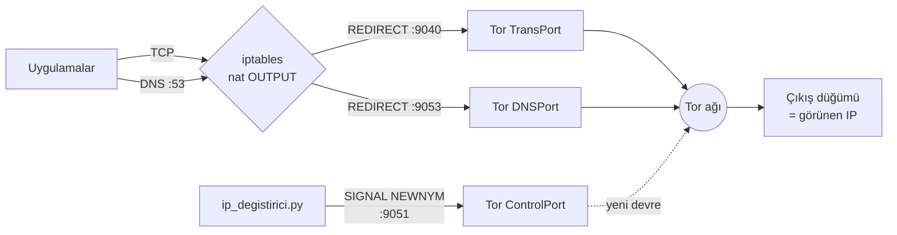

<div align="center">

<pre>
████████╗ ██████╗ ██████╗
╚══██╔══╝██╔═══██╗██╔══██╗
   ██║   ██║   ██║██████╔╝
   ██║   ██║   ██║██╔══██╗
   ██║   ╚██████╔╝██║  ██║
   ╚═╝    ╚═════╝ ╚═╝  ╚═╝
</pre>

# Tor IP Değiştirici

**Tor ağı üzerinden IP adresinizi belirlediğiniz aralıklarla otomatik olarak değiştiren Linux aracı.**


[Özellikler](#-özellikler) •
[Kurulum](#-kurulum) •
[Kullanım](#-kullanım) •
[Nasıl çalışır?](#-nasıl-çalışır) •
[Sorun giderme](#-sorun-giderme)

</div>

---

## ✨ Özellikler

- 🔄 **Otomatik IP değişimi.** Tor'un kontrol portuna `NEWNYM` sinyali gönderir. Her değişimde Tor'u yeniden başlatmaz, bu yüzden hızlıdır ve bağlantı kopmaz.
- 🛡️ **İki çalışma modu**
  - **Saydam mod** (varsayılan): Sistemdeki tüm TCP ve DNS trafiği `iptables` ile Tor'a yönlendirilir.
  - **Proxy modu**: Sistem trafiğine dokunmaz. Yalnızca SOCKS5 (`127.0.0.1:9050`) kullanan uygulamalar Tor'dan geçer.
- 🌍 **Çıkış ülkesi seçimi.** `-u de,nl` ile yalnızca istediğiniz ülkelerden çıkış yapabilirsiniz.
- 🏳️ **Ülke ve bayrak gösterimi.** Ülke bilgisi Tor'un kendi GeoIP veritabanından alınır, üçüncü taraf bir servise sorgu gönderilmez.
- 🚫 **DNS ve IPv6 sızıntı koruması.** DNS sorguları Tor'dan geçer, IPv6 çıkışı engellenir.
- ♻️ **Güvenli çıkış.** `Ctrl+C` ile durdurduğunuzda önceki `iptables` kurallarınız birebir geri yüklenir. Program çökerse `--durdur` ile temizlik yapabilirsiniz.
- 📝 **IP geçmişi.** `-g gecmis.csv` ile tüm IP'leri zaman damgasıyla kaydedebilirsiniz.
- 📊 **Canlı tablo ve özet.** Her değişimin zamanı, IP'si, ülkesi, Tor doğrulaması ve IP'nin gerçekten değişip değişmediği gösterilir.
- 🎨 **Renkli arayüz.** `--renksiz` seçeneği veya `NO_COLOR` ortam değişkeni ile renkler kapatılabilir.
- 📦 **Sıfır bağımlılık.** Yalnızca Python standart kütüphanesini kullanır, `pip install` gerekmez.

## 🖥️ Ekran görüntüsü

```text
  ████████╗ ██████╗ ██████╗
  ╚══██╔══╝██╔═══██╗██╔══██╗
     ██║   ██║   ██║██████╔╝
     ██║   ██║   ██║██╔══██╗
     ██║   ╚██████╔╝██║  ██║
     ╚═╝    ╚═════╝ ╚═╝  ╚═╝
   I P   D E Ğ İ Ş T İ R İ C İ  v2.0.0

 [+] Tor ağına bağlanıldı
 [+] Tüm trafik Tor üzerinden yönlendiriliyor — gizlilik AÇIK
 [*] Aralık: 30 sn · Adet: sınırsız · Çıkmak için Ctrl+C

   ZAMAN        #  IP               KONUM  TOR    DURUM
   14:02:11     —  185.220.101.4    🇩🇪 DE   Tor ✓  başlangıç
   14:02:42     1  45.66.35.10      🇳🇱 NL   Tor ✓  değişti
   14:03:13     2  104.244.73.43    🇱🇺 LU   Tor ✓  değişti
   14:03:44     3  104.244.73.43    🇱🇺 LU   Tor ✓  aynı çıkış
   14:04:15     4  185.220.101.4    🇩🇪 DE   Tor ✓  değişti (tekrar)

 [!] Kullanıcı tarafından durduruldu.
 [*] Özet: 4 kimlik yenileme, 3 farklı IP, süre 00:02:04
 [+] Önceki iptables kuralları geri yüklendi — gizlilik KAPALI
```

## 📥 Kurulum

```bash
git clone https://github.com/battalkoc/tor_ip_degistirici.git
cd tor_ip_degistirici
sudo ./kurulum.sh
```

`kurulum.sh` betiği `tor`, `tor-geoipdb`, `iptables` ve `python3` paketlerini kurar ve Tor servisini başlatır. apt, dnf, pacman ve zypper desteklenir.

<details>
<summary>Elle kurulum (Debian / Ubuntu / Kali)</summary>

```bash
sudo apt install tor tor-geoipdb iptables python3
sudo systemctl enable --now tor
```

</details>

## 🚀 Kullanım

```bash
sudo python3 ip_degistirici.py
```

Parametre vermezseniz program dakikada kaç kez değişim yapılacağını sorar.

### Örnekler

| Komut | Açıklama |
|---|---|
| `sudo python3 ip_degistirici.py -d 2` | Dakikada 2 kez değiştirir |
| `sudo python3 ip_degistirici.py -a 30 -n 10` | 30 saniye arayla toplam 10 kez değiştirir |
| `sudo python3 ip_degistirici.py -a 60 -u de,nl,se` | Yalnızca Almanya, Hollanda ve İsveç çıkış düğümlerini kullanır |
| `sudo python3 ip_degistirici.py -m proxy` | Sistem trafiğine dokunmaz, SOCKS5 proxy olarak çalışır |
| `sudo python3 ip_degistirici.py -g gecmis.csv` | IP geçmişini CSV dosyasına kaydeder |
| `sudo python3 ip_degistirici.py --durum` | Tor durumunu ve mevcut çıkış IP'sini gösterir |
| `sudo python3 ip_degistirici.py --durdur` | Kalmış kuralları temizler ve torrc'yi eski haline getirir |

### Tüm seçenekler

| Seçenek | Varsayılan | Açıklama |
|---|---|---|
| `-d`, `--dakikada SAYI` | etkileşimli | Dakikada kaç değişim yapılacağı (1–6) |
| `-a`, `--aralik SN` | – | İki değişim arasındaki süre, saniye cinsinden (en az 10) |
| `-n`, `--adet SAYI` | `0` (sınırsız) | Toplam değişim sayısı |
| `-u`, `--ulke KODLAR` | – | İki harfli ülke kodları, virgülle ayrılır (ör. `de,nl`) |
| `-m`, `--mod` | `saydam` | `saydam` veya `proxy` |
| `-g`, `--gunluk DOSYA` | – | IP geçmişinin yazılacağı CSV dosyası |
| `--durum` | – | Durum bilgisini gösterir |
| `--durdur` | – | Temizlik yapar |
| `--kontrol-port` | `9051` | Tor kontrol portu |
| `--kontrol-sifre` | – | `HashedControlPassword` kullanıyorsanız şifre. `TOR_KONTROL_SIFRE` ortam değişkeniyle de verilebilir |
| `--socks-port` | `9050` | Tor SOCKS portu |
| `--trans-port` | `9040` | Saydam yönlendirme portu |
| `--dns-port` | `9053` | Tor DNS portu |
| `--renksiz` | – | Renkli çıktıyı kapatır |

> [!NOTE]
> Tor, yeni kimlik (`NEWNYM`) isteklerini en fazla yaklaşık 10 saniyede bir uygular. Bu yüzden en kısa aralık 10 saniyedir. Tor bazen yeni devre için aynı çıkış düğümünü seçebilir. Bu durumda tabloda **aynı çıkış** yazar.

## ⚙️ Nasıl çalışır?



1. `/etc/tor/torrc` dosyasına işaretli bir ayar bloğu eklenir (`TransPort`, `DNSPort`, `ControlPort`, `CookieAuthentication`). Kendi ayarlarınıza dokunulmaz ve blok `--durdur` ile kaldırılabilir.
2. Tor yeniden başlatılır ve ağa bağlanması (bootstrap %100) beklenir.
3. Saydam modda mevcut `iptables`/`ip6tables` kuralları `/var/lib/tor_ip_degistirici/` dizinine yedeklenir ve yönlendirme kuralları uygulanır.
4. Belirlenen aralıklarla kontrol portuna `SIGNAL NEWNYM` gönderilir. Yeni IP `check.torproject.org` üzerinden doğrulanır.
5. Program kapanırken önceki kurallar geri yüklenir.

### Proje yapısı

```text
tor_ip_degistirici/
├── ip_degistirici.py   # Ana program: komut satırı, arayüz, döngü
├── iptablosu.py        # torrc yönetimi, Tor servisi, iptables kuralları
├── tor_kontrol.py      # Tor kontrol portu istemcisi, SOCKS5 ile IP sorgusu
└── kurulum.sh          # Bağımlılık kurulumu
```

## 🩺 Sorun giderme

<details>
<summary><b>Program çöktü, internetim çalışmıyor</b></summary>

`iptables` kuralları etkin kalmış olabilir. Şu komutla eski kurallarınızı geri yükleyin:

```bash
sudo python3 ip_degistirici.py --durdur
```

</details>

<details>
<summary><b>"Tor 120 sn içinde hazır olmadı"</b></summary>

Tor ağına ulaşılamıyor olabilir. Ağınız Tor'u engelliyorsa torrc'ye köprü (bridge) ekleyin. Günlükleri kontrol edin:

```bash
journalctl -u tor@default -n 50
```

</details>

<details>
<summary><b>"Kimlik doğrulanamadı"</b></summary>

torrc'de `HashedControlPassword` tanımlıysa şifreyi verin:

```bash
sudo TOR_KONTROL_SIFRE='şifreniz' python3 ip_degistirici.py
```

</details>

<details>
<summary><b>Ülke "??" görünüyor</b></summary>

Tor'un GeoIP veritabanı kurulu değildir: `sudo apt install tor-geoipdb`

</details>

## ⚠️ Uyarılar

- Tor yalnızca IP adresinizi gizler. Tarayıcı parmak izi, çerezler ve oturum açtığınız hesaplar sizi yine tanımlayabilir. Tam anonimlik için [Tor Browser](https://www.torproject.org/download/) kullanın.
- Saydam mod çalışırken yerel ağ (`192.168.0.0/16`, `172.16.0.0/12`) dışındaki tüm çıkış trafiği Tor'dan geçer. UDP trafiği (DNS hariç) ve IPv6 engellenir.
- Bu araç eğitim ve gizlilik amaçlıdır. Kullanımından doğan sorumluluk kullanıcıya aittir. Lütfen yasalara ve hizmet koşullarına uyun.

<div align="center">

⭐ Projeyi beğendiyseniz yıldız vermeyi unutmayın!

</div>
